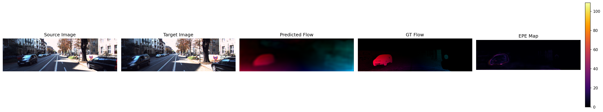
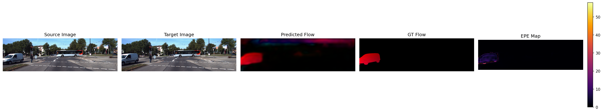
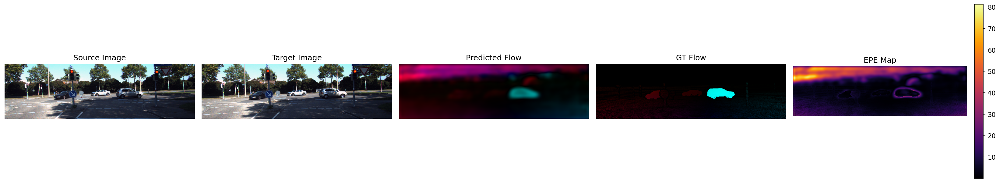
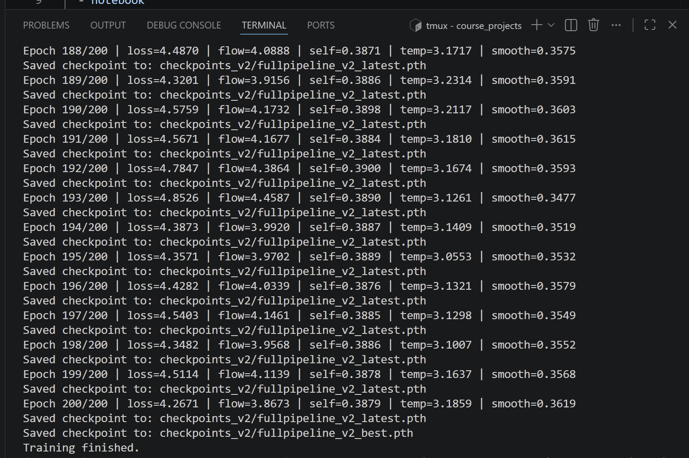
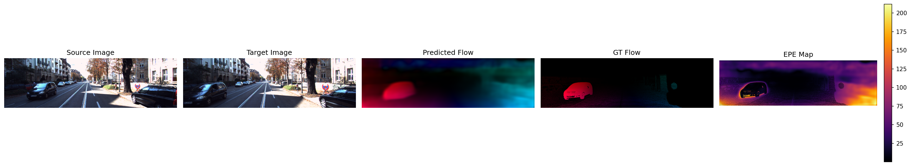
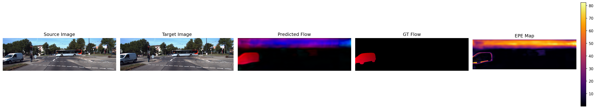
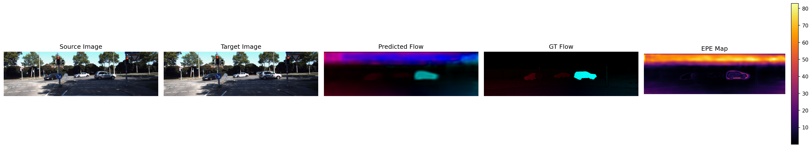
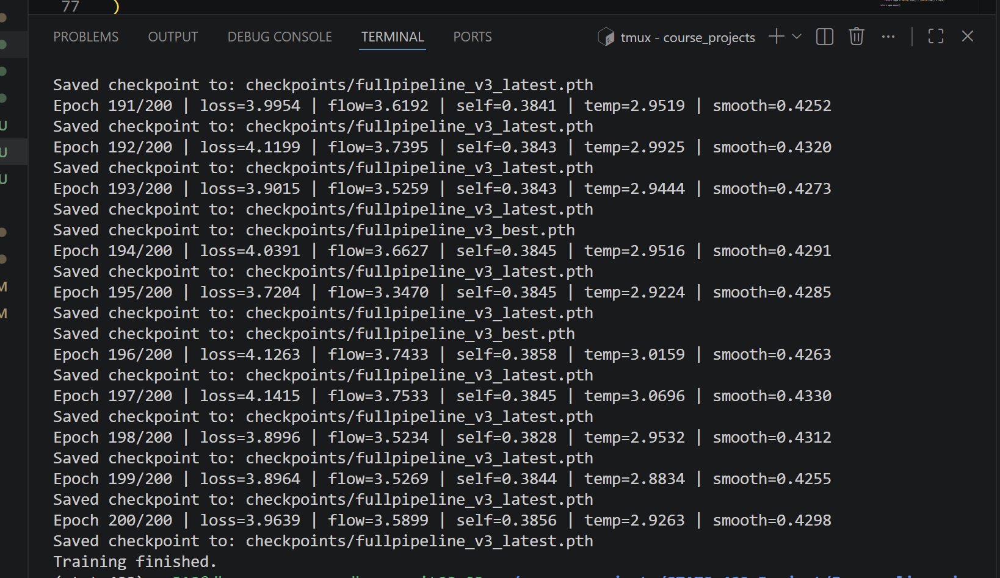

# STATS-402 - Interdisciplinary Data Analysis
## Short-Horizon Temporal Optical Flow with Physics-Informed Consistency
<h3 align="center">Sihan Yao, Yuxuan Huang</h3>

  <a href="mailto:sihan.yao@dukekunshan.edu.cn">sihan.yao@dukekunshan.edu.cn</a> · 
  <a href="mailto:y.huang@dukekunshan.edu.cn">y.huang@dukekunshan.edu.cn</a>

This project investigates **short-horizon spatiotemporal optical / scene flow estimation** by moving beyond 
the traditional two-frame formulation and treating motion as a temporally evolving spatial field. Instead of estimating
motion independently between image pairs, we leverage multi-frame sequences to model motion dynamics over time.

Our core idea is to bridge classical correspondence-based optical flow with **operator-based learning**, enabling the
model to capture both:
- Local pixel-wise motion (pairwise flow)
- Global spatiotemporal structure (motion evolution)

**Pipeline**

**Outcome as of Milestone 2**
Implementation: Full framework except from the Neural Operator module.
Stage 1: With Sobel operator (enhance edge extraction), without self-supervision; 50 epochs
- Example1:

- Example2:

- Example3:

- Example4:

- loss(After 50 epochs)

Stage 2: Adding self-supervision. Trained in DKUCC for 200 epochs:
- Example1:

- Example2:

- Example3:

- loss after 200 epochs:

Stage3: Adding edge awareness loss. Trained in DKUCC for 200 epochs:
- Example1:

- sample2:

- sample3:

- loss after 200 epochs:

- supervised_predict example:
