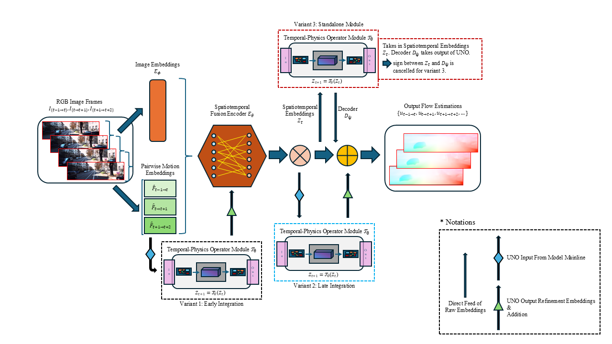
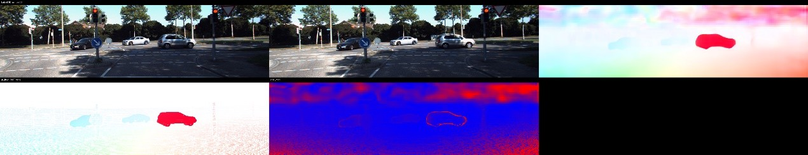
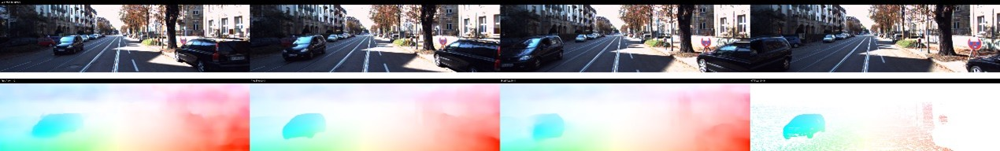
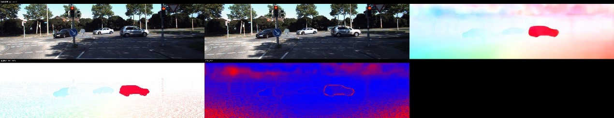
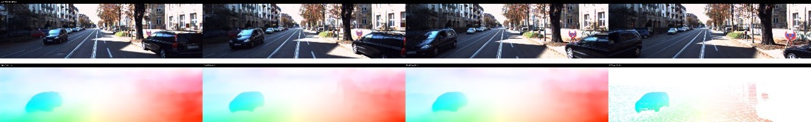
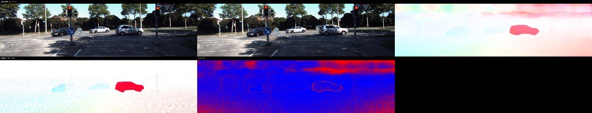
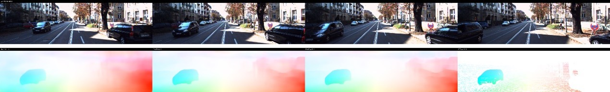
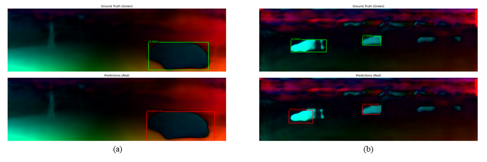

# STATS-402 - Interdisciplinary Data Analysis
## Short-Horizon Temporal Optical Flow with Physics-Informed Consistency
<h3 align="center">Sihan Yao, Yuxuan Huang</h3>
<p align="center">
  <a href="mailto:sihan.yao@dukekunshan.edu.cn">sihan.yao@dukekunshan.edu.cn</a> · 
  <a href="mailto:y.huang@dukekunshan.edu.cn">y.huang@dukekunshan.edu.cn</a>
</p>

**Description:**
This project investigates **short-horizon spatiotemporal optical flow estimation** by moving beyond 
the traditional two-frame formulation and treating motion as a temporally evolving spatial field. Instead of estimating
motion independently between image pairs, we leverage multi-frame sequences to model motion dynamics over time.

The core idea is to bridge classical correspondence-based optical flow with **operator-based learning**, enabling the
model to capture both:
- Local pixel-wise motion (pairwise flow)
- Global spatiotemporal structure (motion evolution)

The pipeline integrates a pairwise flow encoder, a joint visual–motion fusion module, a U-shaped Fourier Neural Operator (UNO), and a PWC-style decoder to model spatiotemporal motion dynamics. A central objective of this work is to investigate how the placement of the neural operator affects model performance.

**What it does:**
The framework takes a short sequence of consecutive frames as input and produces optical flow estimations for adjacent frame pairs. The model extracts motion and visual features, fuses them into a spatiotemporal representation, and refines this representation through a neural operator before decoding it into flow predictions.

We implement and compare three architecture variants:

(1) Standalone UNO (Original Formulation)

The UNO module is applied after the visual–motion fusion encoder, directly operating on fused spatiotemporal embeddings. Its output serves as the input to the decoder without additional residual connections.

(2) Early Integration

The UNO module is inserted before the fusion stage, immediately after the pairwise flow encoder. In this setting, the operator acts on lower-level motion representations, influencing how motion and visual features are subsequently combined.

(3) Late Integration (Refinement)

The UNO module is applied after the fusion encoder as a residual refinement module. Instead of replacing the fused representation, the operator outputs a latent update that is added to the original embedding before decoding. 

Below shows a combined Pipeline Overview of the framework and the variants described above:



**Quick Start:**
After SETUP.md:
To train the Standalone Architecture, run:
```
python train.py --config config.json --architecture_type standalone
```
To train the Early Integration Architecture, run:
```
python train.py --config config.json --architecture_type early
```
To train the Late Integration Architecture, run:
```
python train.py --config config.json --architecture_type later
```
To visualize single frame result (example: Late Integration) with EPE map, run:
```
python visualization.py --config config.json --checkpoint PATH_TO_FLOW_CHECKPOINT.pth --architecture_type TYPE --mode single
```
To visualize short-horizon multiple frames result, run:
```
python visualization.py --config config.json --checkpoint PATH_TO_FLOW_CHECKPOINT.pth --architecture_type TYPE --mode multiple
```
To train downstream object recognition, run:
```
python -m Downstream_Train --config config.json --flow_ckpt PATH_TO_CHECKPOINT.pth
```
To run downstream object recognition inference, run:
```
python -m Downstream_Inference --config config.json --flow_ckpt PATH_TO_FLOW_CHECKPOINT.pth --detector_ckpt PATH_TO_DETECTOR_CKPT.pt --out_dir DIR --save_gt --score_thresh YOUR_THRESHOLD
```
You may toggle `use_gtFlow_for_training` in config.json

To use other architectures, simply replace `later` with `early` or `standalone` in both `--checkpoint` and `--architecture_type`.

We do provide precomputed stats on images and a template default `config.json` in `utils`. But they are also included in respective directories for easy access.

These models are based on the same training configurations as the existing `config.json` in this repository. All models are trained for 400 epochs. The checkpoints record the best training outcome throughout the total *400* epochs.

**Example Results:**
We evaluate the performance of three architecture variants under the same training and experimental settings on KITTI 2015 training set. The comparison focuses on standard optical flow metrics, including End-Point Error (EPE), per-image EPE (F1-EPE), and outlier ratio (F1-all%).

| Model Variant        | EPE ↓    | F1-EPE ↓ | F1-all% ↓ |
|---------------------|----------|----------|-----------|
| Standalone          | 2.9234   | 2.7889   | **20.59** |
| Early Integration   | **2.6255** | **2.5596** | 22.11     |
| Late Integration    | 2.7647   | 2.6673   | 23.30     |

Here we also show a few estimation results from our model:

*Pairwise* estimation; *Early* Integration:



*Short-horizon* estimation; *Early* Integration:



*Pairwise* estimation; *Late* Integration:



*Short-horizon* estimation; *Late* Integration:



*Pairwise* estimation; *Standalone*:



*Short-horizon* estimation; *Standalone*:



We demonstrate the downstream application using a simple motion detection task. For example:



where estimations of our model can be recognized by machine vision.

To acquire our pretrained parameters, please visit:

https://drive.google.com/drive/folders/1sI5MRbYDaK74UZoG1SCNU_EO40zRdl8L