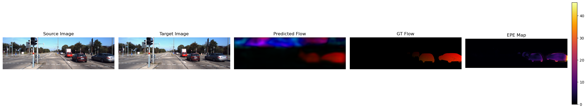
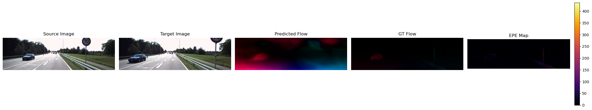
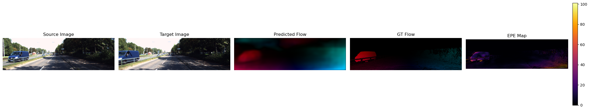
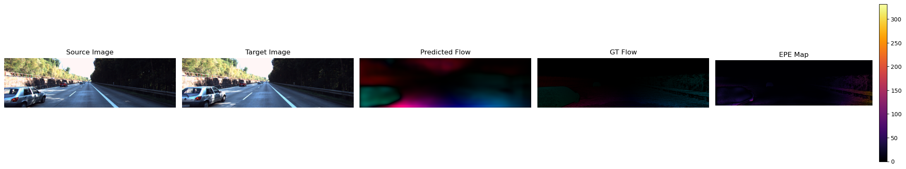
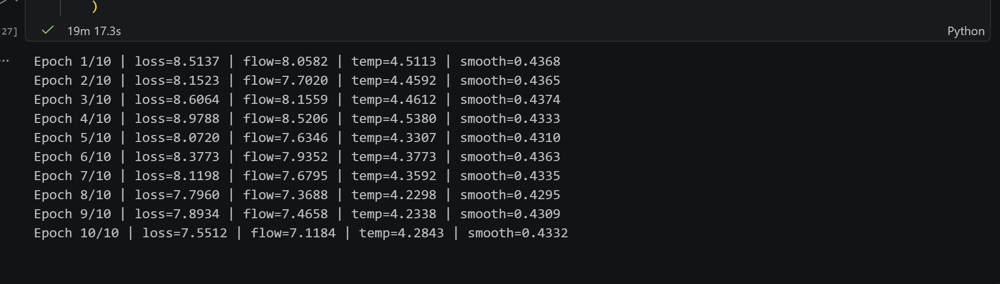
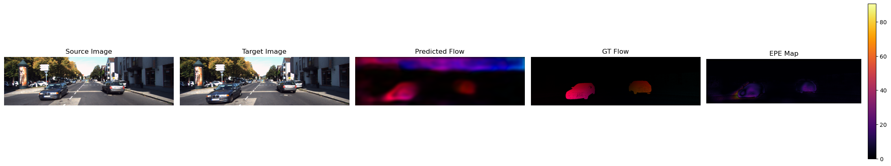
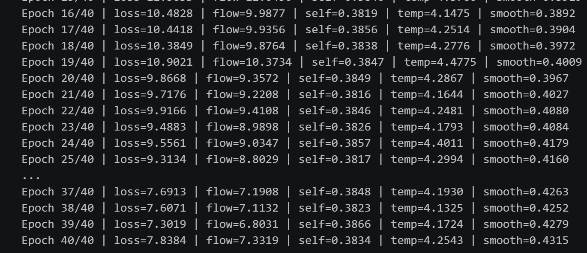

# STATS-402 - Interdisciplinary Data Analysis
## Short-Horizon Temporal Optical Flow with Physics-Informed Consistency
<h3 align="center">Sihan Yao, Yuxuan Huang</h3>

  <a href="mailto:sihan.yao@dukekunshan.edu.cn">sihan.yao@dukekunshan.edu.cn</a> · 
  <a href="mailto:y.huang@dukekunshan.edu.cn">y.huang@dukekunshan.edu.cn</a>

This project investigates **short-horizon spatiotemporal optical / scene flow estimation** by moving beyond 
the traditional two-frame formulation and treating motion as a temporally evolving spatial field. Instead of estimating
motion independently between image pairs, we leverage multi-frame sequences to model motion dynamics over time.

Our core idea is to bridge classical correspondence-based optical flow with **operator-based learning**, enabling the
model to capture both:
- Local pixel-wise motion (pairwise flow)
- Global spatiotemporal structure (motion evolution)

Pipeline

Outcome
Stage 1: With sobel operator, without self-supervised; After 50 epochs
- sample1:

- sample2:

- sample3:

- sample4:

- loss(After 50 epochs)

Stage 2: Adding Self_supervise:
- sample1:

- sample2:

- loss(After 50 epochs)
